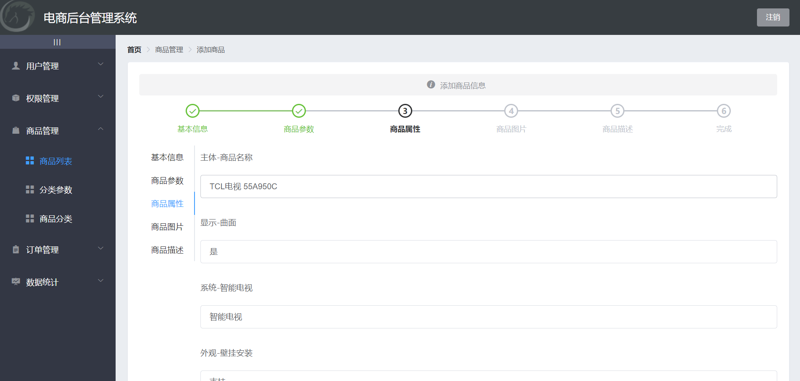

# vue-shop



##### 电商后台管理系统，在线演示地址： http://jaysonl.top/shop (admin & 123456)

使用的技术栈：

`vue` + `vue-router` + `element-ui` + `axios`

使用的插件：

> `nprogress` 加载指示器
>
> `echarts` 可视化图表
>
> `vue-quill-editor` 富文本编辑器
>
> `vue-table-with-tree-grid` 树状表格


## 🔨 Usage

#### 前端部分

##### 安装依赖

```
npm install
```

##### 运行（开发模式）

```
npm run serve
```

##### 打包（生产模式）

```
npm run build
```


#### 后端部分

###### 1、解压 `backend/vue-api-server.zip`

###### 2、进入解压好的文件夹

###### 3、创建数据库mydb（或其他名称），导入`db/mydb.sql`文件到该数据库

###### 4、编辑`config/default.json`文件，配置MySQL用户名、密码、数据库名

###### 5、执行以下命令安装依赖、启动服务：

```
npm install
node app.js
```


